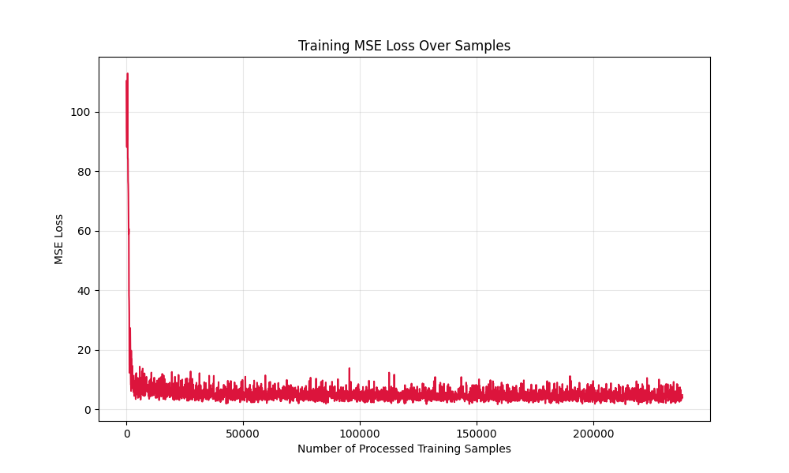
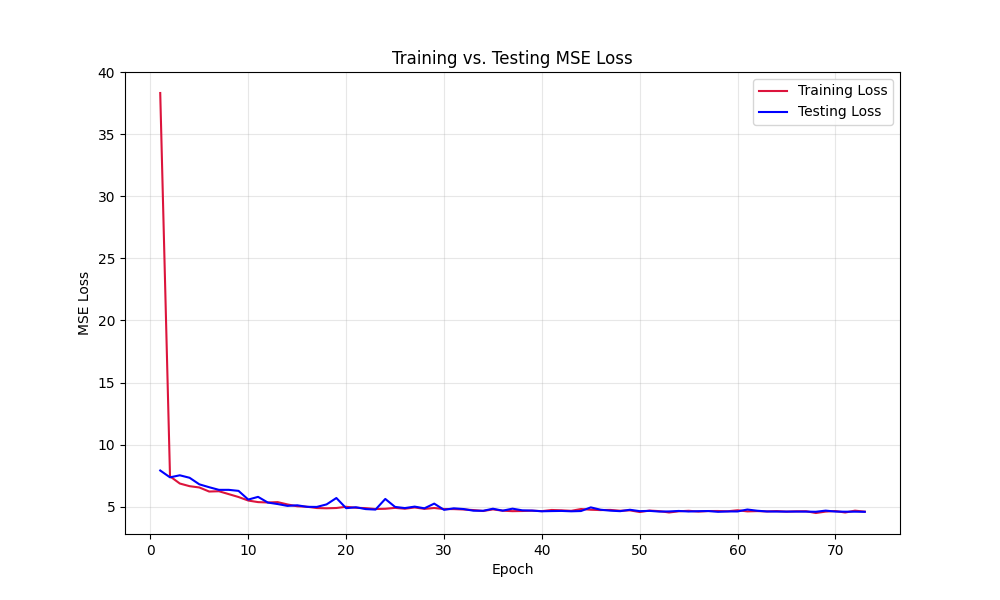
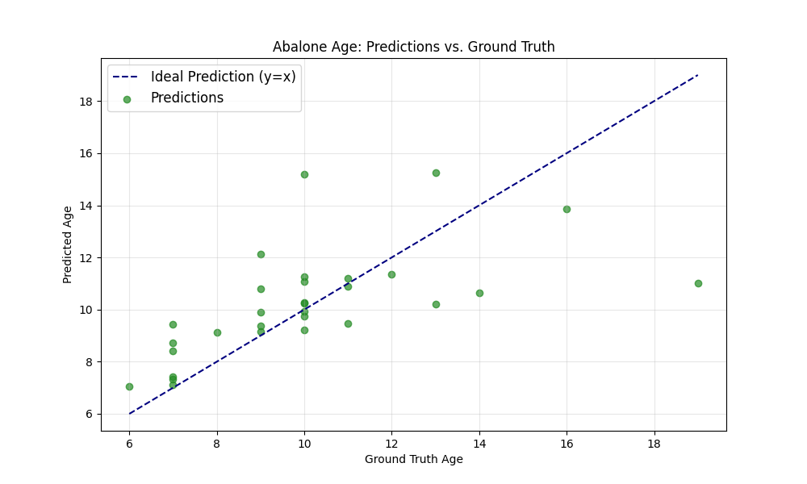
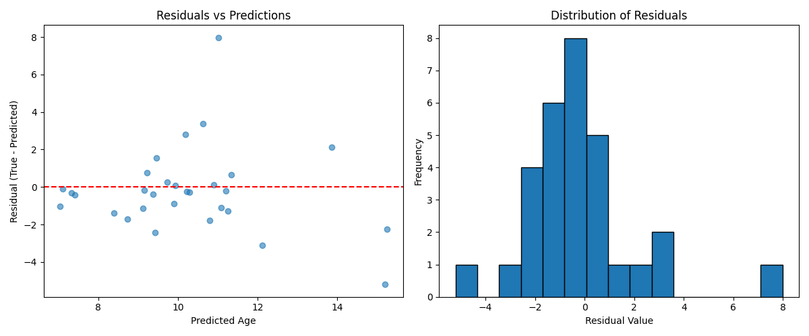

# Lecture 1: Abalone Age Prediction  


## I. Introduction  
Linear regression is a classic **supervised learning regression algorithm** in machine learning. Its core is to predict continuous values by fitting the linear relationship between independent variables (features) and the dependent variable (target) in a dataset. Its core logic can be broken down into three main modules: hypothesis function, loss function, and optimization algorithm.  


### 1. Hypothesis Function: Linear Combination of Features  
Assuming a linear relationship exists between features and abalone age, the prediction is calculated using the following formula:  
$$ \hat{y} = w \cdot X + b $$  
- $\hat{y}$: Predicted abalone age;  
- $X$: Input features (e.g., weight, gender encoding, etc.);  
- $w$: Feature weights (reflecting the degree of influence of each feature on age);  
- $b$: Bias term (adjusting the baseline prediction value).  

For multi-feature scenarios, $w$ is a vector, and the function is essentially a "weighted sum of features + bias".  


### 2. Loss Function: Measuring Prediction Error  
**Mean Squared Error (MSE)** is used to quantify the deviation between predicted values and true values:  
$$ \text{MSE} = \frac{1}{n} \sum_{i=1}^n (\hat{y}_i - y_i)^2 $$  
- $n$ is the number of samples, $\hat{y}_i$ is the predicted value for the $i$-th sample, and $y_i$ is the corresponding true value;  
- MSE amplifies the impact of significant errors through "squaring", prompting the model to prioritize correcting large deviations.  


### 3. Optimization Algorithm: Gradient Descent for Optimal Solutions  
**Stochastic Gradient Descent (SGD)** is used to minimize MSE, adjusting $w$ and $b$ incrementally:  
1. Calculate the gradients (partial derivatives) of the loss with respect to $w$ and $b$;  
2. Adjust the parameters in the direction opposite to the gradients (step size controlled by the learning rate);  
3. Repeat the above steps until the loss converges.  


## II. Data Loading and Preprocessing (`load_and_preprocess_data`)  
Data preprocessing is a critical prerequisite for model performance. This function implements the end-to-end process from "raw data reading" to "training set preparation", supporting **gender feature encoding selection** and **outlier handling toggling**. Its parameters and steps are as follows:  


### 1. Key Parameter Description  

| Parameter Name   | Type    | Default Value | Function Description                                                                 |
|------------------|---------|---------------|--------------------------------------------------------------------------------------|
| `file_path`      | str     | None          | Path to the data file; if None, it automatically uses "parent directory of the script/data/AbaloneAgePrediction.txt" |
| `use_onehot`     | bool    | True          | Whether to use one-hot encoding for gender features (True = one-hot encoding, False = numerical mapping) |
| `handle_outliers`| bool    | True          | Whether to handle outliers in numerical features using the 3σ principle                |  


### 2. Key Processing Steps  

#### (1) Raw Data Reading and Separation  
- Data format: Each line represents one abalone sample, containing 10 fields (the first 9 are features: 1 categorical feature "gender" + 8 numerical features; the last field is the target "age").  
- Code logic:  
  ```python
  data_X.append(line_components[:-1])  # Features: gender + 8 numerical features
  data_Y.append(line_components[-1])   # Target: age
  ```  
- Data type conversion: Convert numerical features and the target to `np.float32`.  


#### (2) Gender Feature Encoding (Categorical Feature Handling)  
Gender is a **categorical feature** (values: M = Male, F = Female, I = Infant) and must be converted to a numerical format before being input into the model. Two encoding methods are provided:  

- **Method 1: One-Hot Encoding (`use_onehot=True`)**  
  `OneHotEncoder` is used to convert 1 categorical feature into 3 binary features (e.g., M → [1,0,0], F → [0,1,0], I → [0,0,1]), preventing the model from mistakenly treating "gender" as an ordinal feature.  
  Feature dimension after encoding: 3 (one-hot gender) + 8 (numerical features) = 11.  

- **Method 2: Numerical Mapping (`use_onehot=False`)**  
  A dictionary maps genders to 0/1/2 (M = 0, F = 1, I = 2). Feature dimension after encoding: 1 (numerical gender) + 8 (numerical features) = 9.  
  Drawback: Introduces an "ordinal assumption", which may interfere with the model. Thus, one-hot encoding is used by default.  


#### (3) Outlier Handling (3σ Principle)  
Outliers severely affect the fitting performance of regression models. This function only processes outliers in **numerical features** (8 morphological features):  
1. For each numerical feature, calculate its **mean** and **standard deviation (std)**;  
2. Define the normal range: `[mean - 3*std, mean + 3*std]` (statistically, 99.7% of data falls within this range; values outside are considered outliers);  
3. Filter outlier samples: Retain samples where all features fall within the normal range, and update gender features and the target synchronously (to ensure data consistency);  
4. Recombine features: After filtering, re-concatenate "encoded gender" and "numerical features" to generate the new `data_X`.  


#### (4) Feature Normalization (Min-Max Normalization)  
Differences in feature scales (e.g., shell length may be in "centimeters" and shell weight in "grams") cause the model to be more sensitive to large-scale features. Therefore, all features are normalized to the `[0,1]` range:  
```python
data_X[:, feature_idx] = (data_X[:, feature_idx] - feature_min) / (feature_max - feature_min)
```  
- The check `if feature_max > feature_min` is added to avoid "division by zero" errors when all values of a feature are identical (e.g., a feature has the same value across all samples).  


#### (5) Dataset Splitting and Return  
- `train_test_split` is used to split the dataset into training and test sets at an 8:2 ratio. `random_state=42` ensures consistent splitting results across runs (reproducibility);  
- Combine `train_data` and `test_data`: Concatenate features and the target into a single array (e.g., the number of columns in `train_data` = number of features + 1) to facilitate batch-wise data reading later;  
- Return values: Training/test set features (`X_train`/`X_test`), training/test set targets (`Y_train`/`Y_test`), combined data (`train_data`/`test_data`), and input feature dimension (`input_dim`, used for model initialization).  


## IV. Regression Model Definition (`RegressionModel`)  
This class inherits from `torch.nn.Module` and implements a **3-layer MLP (Multi-Layer Perceptron)** (Input Layer → Hidden Layer 1 → Hidden Layer 2 → Output Layer), suitable for regression tasks. Its structure is as follows:  


### 1. Class Structure Analysis  

#### (1) `__init__` Method (Layer Definition)  
```python
def __init__(self, input_dim):
    super(RegressionModel, self).__init__()
    self.fc1 = torch.nn.Linear(input_dim, 32)  # Input Layer → Hidden Layer 1 (32 dimensions)
    self.fc2 = torch.nn.Linear(32, 16)         # Hidden Layer 1 → Hidden Layer 2 (16 dimensions)
    self.fc3 = torch.nn.Linear(16, 1)          # Hidden Layer 2 → Output Layer (1 dimension, regression result)
    self.relu = torch.nn.ReLU()                # ReLU activation function (introduces non-linearity)
    self.dropout = torch.nn.Dropout(0.2)       # Dropout layer (prevents overfitting, 20% dropout rate)
```  
- `input_dim`: Input feature dimension (returned by the data preprocessing module; 11 for one-hot encoding, 9 for numerical encoding);  
- **Role of the Dropout layer**: Randomly "deactivates" 20% of neurons during training to prevent the model from over-relying on a few features, improving generalization ability;  
- Output layer dimension = 1: The regression task requires outputting a continuous "age" value, so no activation function is used (adding an activation function would limit the output range—e.g., sigmoid restricts values to [0,1], which is inconsistent with the continuous distribution of age).  


#### (2) `forward` Method (Forward Propagation)  
Defines the data flow path within the model:  
```python
def forward(self, x):
    x = self.fc1(x)       # Input → Hidden Layer 1
    x = self.relu(x)      # Activation function (introduces non-linearity to address the inability of linear models to fit complex relationships)
    x = self.dropout(x)   # Dropout (only active during training; automatically disabled during testing)
    x = self.fc2(x)       # Hidden Layer 1 → Hidden Layer 2
    x = self.relu(x)      # Activation function
    x = self.fc3(x)       # Hidden Layer 2 → Output Layer (predicted age)
    return x
```  
- Forward propagation is the model’s "core computation logic". PyTorch automatically constructs a computation graph based on this method for gradient calculation via backpropagation.  


## V. Model Training Function (`train_model`)  
This function is the core of the training logic, integrating **batch training, learning rate scheduling, early stopping, and model saving** to ensure efficient model convergence and prevent overfitting.  


### 1. Key Parameters and Training Configuration  

| Parameter/Configuration | Value/Logic                                                                 | Function Description                                                                 |
|-------------------------|-----------------------------------------------------------------------------|--------------------------------------------------------------------------------------|
| `EPOCHS`                | 200                                                                         | Maximum number of training epochs (ends early if early stopping is triggered)         |
| `BATCH_SIZE`            | 64                                                                          | Batch size for each training iteration (balances training speed and memory usage; 64 is a common choice) |
| `LEARNING_RATE`         | 0.001                                                                       | Initial learning rate (controls the step size of parameter updates)                   |
| `patience`              | 15                                                                          | Patience for early stopping (training stops if test loss does not decrease for 15 consecutive epochs) |
| `best_test_loss`        | `float('inf')`                                                              | Records the optimal test loss (initialized to infinity for easy subsequent updates)   |
| `optimizer`             | `torch.optim.SGD(model.parameters(), lr=0.001, momentum=0.9)`               | SGD optimizer (with momentum=0.9 to accelerate convergence and reduce oscillations)  |
| `scheduler`             | `ReduceLROnPlateau(optimizer, mode='min', factor=0.5, patience=5)`          | Learning rate scheduler (adjusts LR based on test loss): If test loss does not decrease for 5 epochs, LR is halved |  


### 2. Detailed Training Process  

#### (1) Initialization and Preparation  
- Set the model to training mode: `model.train()` (enables training-specific behavior for Dropout and BatchNorm layers);  
- Test data conversion: Convert test set features and targets to PyTorch tensors and move them to the specified device (CPU/GPU) to avoid repeated conversion during each evaluation;  
- Instantiate visualization tools: Used to record training metrics.  


#### (2) Epoch Loop Training  
1. **Shuffle training data**: `np.random.shuffle(train_data)`—shuffles data order every epoch to prevent the model from learning "data order dependence";  
2. **Split into mini-batches**: Divide the training data into batches according to `BATCH_SIZE` to implement "batch training" (reduces memory usage and improves training stability);  
3. **Batch training logic**:  
   ```python
   # 1. Convert batch data to tensors
   features_tensor = torch.tensor(batch_features, device=device)
   labels_tensor = torch.tensor(batch_labels, device=device)
   # 2. Forward propagation: Calculate predicted values and MSE loss
   predictions = model(features_tensor)
   mse_loss = F.mse_loss(predictions, labels_tensor)
   # 3. Backpropagation: Clear gradients → Calculate gradients → Update parameters
   optimizer.zero_grad()  # Clear gradients from the previous iteration (to avoid gradient accumulation)
   mse_loss.backward()    # Backpropagation to compute gradients
   optimizer.step()       # Optimizer updates model parameters
   ```  


#### (3) Per-Epoch Evaluation and Optimization  
1. **Test set evaluation**:  
   - Set the model to evaluation mode: `model.eval()` (disables Dropout and fixes statistics for BatchNorm layers);  
   - Disable gradient computation: `with torch.no_grad()`—avoids gradient calculation during evaluation to save memory and time;  
   - Calculate test loss: `test_loss = F.mse_loss(test_preds, test_labels).item()`, and record metrics.  

2. **Learning rate scheduling**: `scheduler.step(test_loss)`—adjusts the learning rate based on test loss (LR remains unchanged if test loss decreases; LR is halved if test loss stagnates), preventing parameter oscillations due to excessively large LR in later stages.  

3. **Early stopping mechanism (prevents overfitting)**:  
   - If the current test loss < optimal test loss: Update `best_test_loss`, save model parameters (`torch.save(model.state_dict(), "best_abalone_model.pth")`), and reset `patience_counter`;  
   - If the current test loss ≥ optimal test loss: Increment `patience_counter`; if the counter reaches `patience` (15), trigger early stopping, print a prompt, and exit training.  


#### (4) Return the Optimal Model  
After training, load the saved optimal model parameters (`model.load_state_dict(torch.load("best_abalone_model.pth"))`) to ensure the returned model has the strongest generalization ability.  


## VI. Model Evaluation Function (`run_evaluation`)  
This function evaluates the model on the test set, outputting **sample-level prediction results** and **quantitative evaluation metrics** to objectively assess model performance.  


### 1. Core Logic  
1. Set the model to evaluation mode: `model.eval()`;  
2. Data preparation: Extract test set features and targets, and select the first 30 samples (`batch_size=30`) for detailed display (to avoid excessive output);  
3. Model inference: Disable gradients with `with torch.no_grad()`, compute predicted values, and convert them to NumPy arrays (`cpu().numpy().flatten()`);  
4. Metric calculation: Compute 4 core metrics for regression tasks:  
   - **MSE (Mean Squared Error)**: Measures the average squared deviation between predicted and true values (penalizes large errors more heavily);  
   - **RMSE (Root Mean Squared Error)**: Square root of MSE, with the same unit as the target (e.g., years for age), making it more interpretable;  
   - **MAE (Mean Absolute Error)**: Measures the average absolute deviation between predicted and true values (more robust to outliers);  
   - **R² (Coefficient of Determination)**: Measures the proportion of variance in the data explained by the model (value range: [0,1]; closer to 1 indicates better model fitting).  


### 2. Result Output  
- Print the "predicted value, true value, and absolute error" for the first 30 samples to visually observe individual prediction performance;  
- Print the 4 quantitative metrics to objectively evaluate overall model performance;  
- Return "true value list" and "predicted value list" for subsequent visualization.  


## VII. Main Function  
The main function serves as the "entry point" of the code, connecting all modules to form a complete workflow of "Data → Training → Evaluation → Visualization". The steps are as follows:  
1. **Device selection**: Prioritize using GPU (`torch.device("cuda" if torch.cuda.is_available() else "cpu")`), as GPUs significantly accelerate training;  
2. **Data preprocessing**: Call `load_and_preprocess_data` with one-hot encoding and outlier handling enabled to obtain training/test data and input dimension;  
3. **Model initialization**: Create an instance of `RegressionModel` and move it to the specified device;  
4. **Model training**: Call `train_model` to obtain the optimal model and visualization tools;  
5. **Training process visualization**: Call the plotting method of the visualization tool to check training convergence;  
6. **Model evaluation**: Call `run_evaluation` to obtain true values and predicted values;  
7. **Prediction result visualization**: Call the plotting method of the visualization tool to visually assess prediction performance.  


## VIII. Evaluation and Result Analysis  
The model’s ability to learn the "feature → age" relationship is judged using **loss curves, prediction visualizations, and quantitative metrics**.  


### 1. Loss Curves: Training Stability  
- : Rapid decline in the early stage and stabilization in the later stage, indicating the model effectively learns feature patterns;  
- : Consistent trends and final convergence of the two curves, indicating **no significant overfitting** (overfitting occurs only if test loss is much higher than training loss).  


### 2. Prediction Visualization: Intuitive Deviation  
  
- Ideal scenario: Points are distributed near the `y=x` dashed line, indicating accurate predictions;  
- Actual scenario: Most samples are close to the dashed line, but **samples with high ages (true age > 15 years) show large deviations**, meaning the model underperforms in fitting extreme cases.  


### 3. Quantitative Metrics: Numerical Evaluation  

| Metric | Meaning                                  | Result  | Interpretation                                                  |
|--------|------------------------------------------|---------|-----------------------------------------------------------------|
| MSE    | Mean Squared Error                       | ~5.12   | Average squared error across all samples                        |
| RMSE   | Root Mean Squared Error                  | ~2.26   | Average deviation between predicted and true values (unit: years) |
| MAE    | Mean Absolute Error                      | ~1.50   | Most samples have a deviation within 1.5 years                  |
| R²     | Proportion of age variance explained by features | ~0.35 | Only 35% of age variation can be explained by the features      |  

```python
# Example code for calculating evaluation metrics
mse = mean_squared_error(test_labels_subset, predictions)
rmse = np.sqrt(mse)
mae = mean_absolute_error(test_labels_subset, predictions)
r2 = r2_score(test_labels_subset, predictions)
```  


### 4. Residual Analysis: Insights into Error Distribution  
  

- Left graph (scatter plot of residuals vs. predicted values): Most points are close to the red line where "residual = 0", indicating small prediction errors for most samples. However, there are a few outliers (e.g., significant residual deviations for samples with high predicted ages), meaning the model has large prediction errors for some samples (e.g., high-age samples).  

- Right graph (residual distribution histogram): Residuals are mainly concentrated around 0, but the distribution is asymmetric, with a small number of samples having large absolute residuals. There is room for improvement in the randomness of the model’s errors.